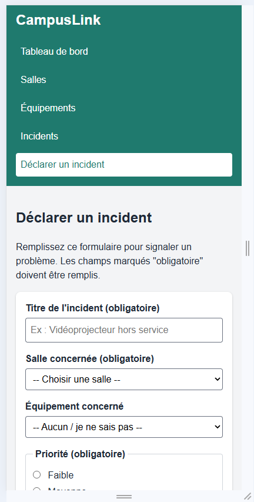
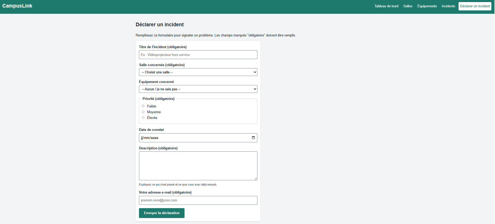

# CampusLink - FR01 : interface statique (HTML/CSS)

## Contexte

CampusLink est une plateforme de gestion du campus (salles, équipements, incidents). Cette mission FR01 du projet fil rouge Ynov B1 (2026-2027) consiste à concevoir l'**interface statique** du produit : une maquette en HTML et CSS, sans JavaScript, base de données ni serveur.

Dépôt GitHub : https://github.com/aliciaahze/Projet-fil-rouge-Alicia-Antonin-

## Auteurs

- Antonin MINGOT
- Alicia HOZE

## Prérequis

- Un navigateur récent (Chrome, Edge, Firefox ou Safari).
- Optionnel : VSCode.

## Lancer le projet

1. Télécharger ou cloner le dépôt.
2. Ouvrir le dossier du projet (celui qui contient `index.html`) dans VSCode.
3. Ouvrir `index.html` dans le navigateur (ou clic droit puis "Open with Live Server" dans VSCode).

Aucune installation ni commande n'est nécessaire.

## Fonctionnalités (maquette)

| Écran | Fichier | Contenu |
|---|---|---|
| Tableau de bord | `index.html` | Vue d'ensemble : salles, équipements, incidents, derniers incidents |
| Salles | `pages/salles.html` | Liste des salles avec type, étage, capacité et statut |
| Équipements | `pages/equipements.html` | Liste des équipements avec salle, type, état et statut |
| Incidents | `pages/incidents.html` | Liste des incidents avec salle, équipement, priorité et statut |
| Détail d'un incident | `pages/incident-detail.html` | Fiche détaillée d'un incident |
| Déclaration d'un incident | `pages/declaration.html` | Formulaire de signalement avec champs obligatoires |

## Arborescence

```
Projet-fil-rouge-Alicia-Antonin-/
├── index.html
├── pages/
│   ├── salles.html
│   ├── equipements.html
│   ├── incidents.html
│   ├── incident-detail.html
│   └── declaration.html
├── css/
│   └── style.css
├── images/
└── README.md
```

## Choix techniques

- **HTML sémantique** : `header`, `nav`, `main`, `section`, `article`, `footer`, un seul `h1` par page et des titres hiérarchisés.
- **CSS structuré** : une seule feuille `css/style.css` partagée par les 6 pages, découpée en parties commentées, avec des variables de couleurs dans `:root`.
- **Flexbox** pour l'en-tête et le menu, **Grid** pour les cartes (`repeat(auto-fit, minmax(220px, 1fr))`).
- **Mobile first** : le style de base vise le téléphone, puis une règle `@media (min-width: 768px)` passe l'en-tête et le menu en ligne sur grand écran.
- **Accessibilité** : `lang="fr"`, lien d'évitement vers le contenu, menu avec `aria-label`, champs de formulaire reliés à leur `label`, groupe de boutons radio avec `fieldset` et `legend`, contour visible au focus clavier, couleur principale choisie pour un contraste suffisant avec le texte blanc.
- **Standards** : les 6 pages ont été vérifiées avec le validateur HTML du W3C.

## Scénario de démonstration

1. Ouvrir `index.html` : le tableau de bord affiche les cartes de synthèse.
2. Cliquer sur **Salles**, puis **Équipements** : listes avec statuts colorés.
3. Cliquer sur **Incidents**, puis sur **Voir le détail** : la fiche d'un incident s'ouvre.
4. Cliquer sur **Déclarer un incident** : envoyer le formulaire vide, le navigateur signale les champs obligatoires.
5. Remplir le formulaire et l'envoyer : retour à la liste des incidents.
6. Réduire la fenêtre (ou `F12` puis mode mobile) : le menu passe en colonne et les cartes s'empilent.

## Limites connues

- Les données (salles, équipements, incidents) sont fictives et écrites directement dans le HTML.
- Le formulaire n'enregistre rien : il redirige simplement vers la liste des incidents.
- Toutes les fiches "Voir le détail" ouvrent le même exemple d'incident.

## Captures d'écran

- Version mobile : 
- Version desktop : 